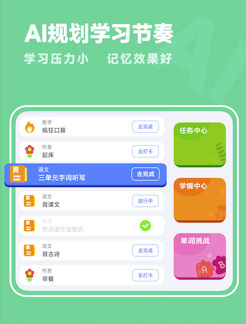
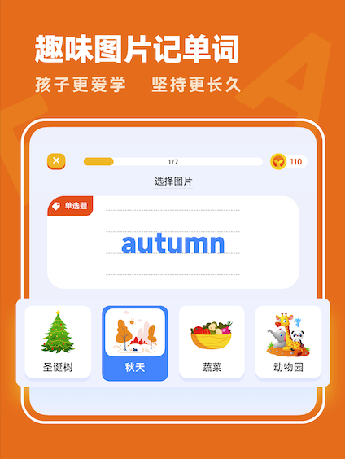

# report
### 1. 声明
- “海小豚家园App”， iOS 目前已下架；
- 新版的  “海小豚家园(新)App” 正在审核中；

### 2. 介绍

海小豚家园(新) 学习助手， 解决家长辅导孩子的困难！

功能介绍：
1、同步测试：每天放学后10分钟，让您了解孩子课堂知识掌握情况
2、精准评估：多维度考量测试表现，评价知识掌握度更合理
3、个性学习：根据学情推荐个性化学习路径和学习方法
4、科学复习：综合孩子学期、遗忘曲线等，制定切实可行的复习计划
5、趣味拓展：推荐适合孩子水平的阅读内容，让学有余力的孩子拓展视野，提高素养
6、成长报告：详细的学习报告，动态更新知识掌握情况
孩子学习知识点、练习时间显著减少，无效做题时间减少50%以上，课堂漏洞当天补全
提高作业效率，提升学习意愿！

### 3. 联系方式 和 技术支持

邮箱：2033406602@qq.com
